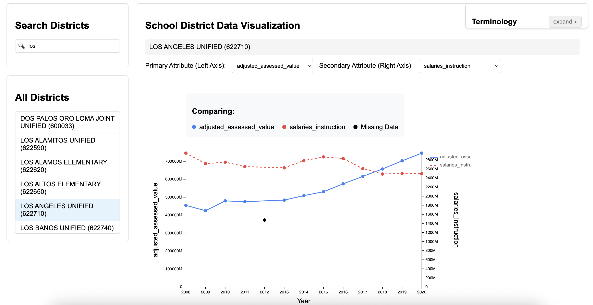

# California School District Financial Data Explorer

**Author:** Wilson Schwegler, Matthew Uytioco, Chai Rui, & Ruige Wu  
**Affiliation:** Occidental College  
**Live Application:** https://caschooldistrictsfinancialdataexplorer.onrender.com

---

## Project Overview

The California School District Financial Data Explorer is a web-based application designed to make California school district financial data **accessible, searchable, and interactive** for researchers, educators, and policymakers.

Public education finance data is often fragmented across multiple state sources and difficult to work with at scale. This project integrates datasets from the California Department of Education and the State Controller’s Office into a unified, continuously updateable dataset, paired with an interactive visualization interface.

The application supports both **data exploration** and **data maintenance**, allowing authorized users to merge newly released public data and immediately reflect updates in the visualization tool.

---

## Key Features

- **Interactive Data Visualization**
  - Search and explore financial attributes by school district and year
  - Visual indicators for missing or invalid data
  - Built-in terminology reference for financial variables

- **Dataset Download**
  - One-click access to the latest cleaned and merged dataset

- **Automated Data Integration**
  - Backend pipeline for merging new state data releases
  - Fuzzy string matching to resolve inconsistent district identifiers
  - Multi-step validation to preserve dataset integrity

- **Web-Based Administration**
  - Password-protected upload and database update workflows
  - Immediate propagation of updated data to the visualization layer

---

## Repository Structure

app/            Flask application logic

templates/      HTML templates

static/         CSS and static assets

main.py         Application entry point

config.py       Configuration settings

requirements.txt Python dependencies

README.md       Project documentation

---

## Screenshots

### Home Page 

### Visualization Interface

